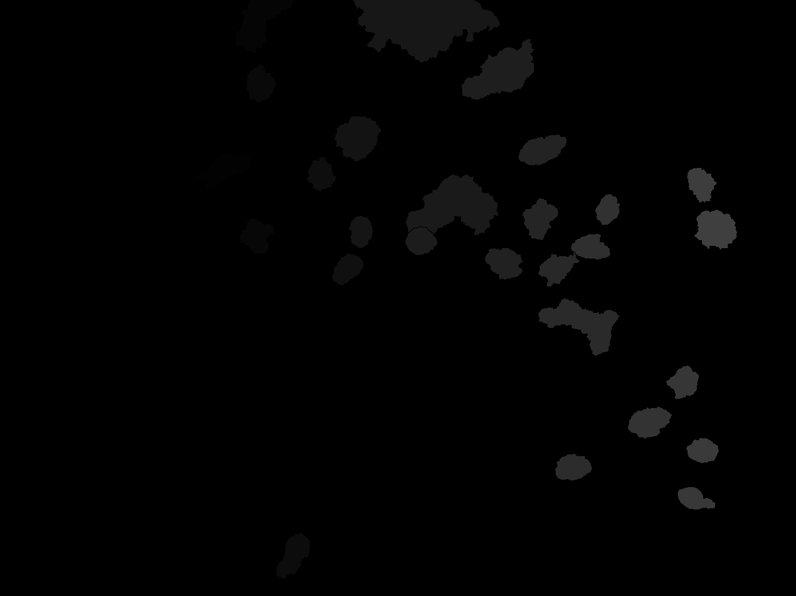
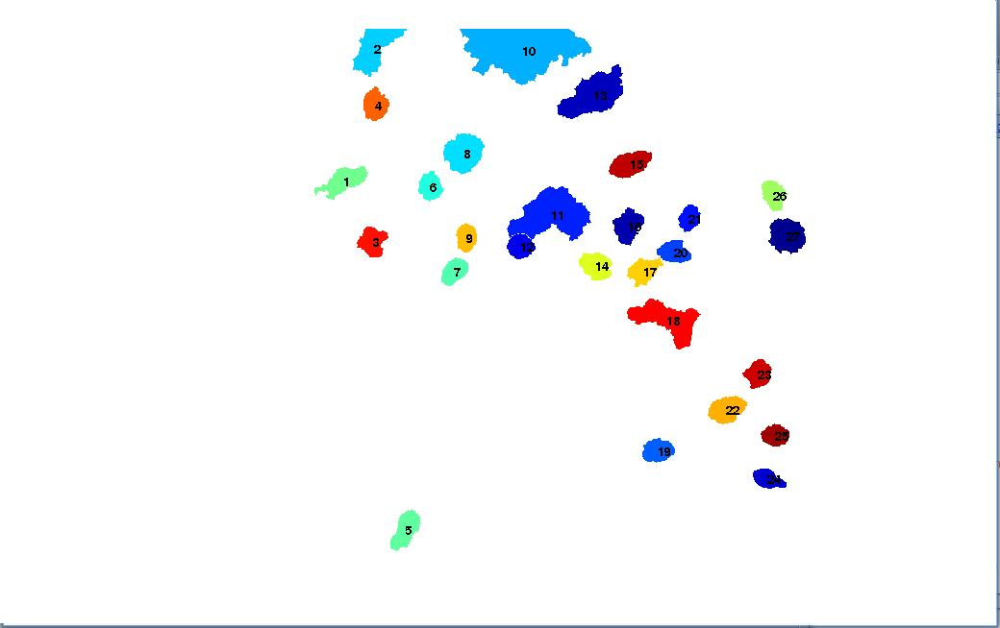

IntensitySum
============

Background subtraction and ARN intensity sum for each segmented nucleus after a fish experiment

* Load Segmented cell and original cell image to the matlab figure

* Output

* Nucleus Label

